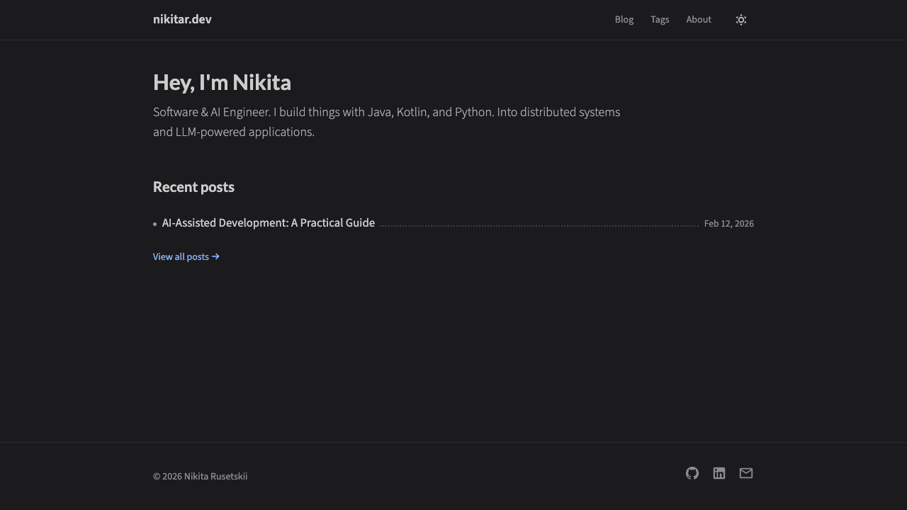

<h1 align="center">🌐 nikitar.dev</h1>

<p align="center">
  Personal portfolio and blog built with Nuxt 3, Tailwind CSS, and Nuxt Content.
</p>

<p align="center">
  <a href="https://github.com/xtenzQ/nikitar.dev/actions/workflows/deploy.yml">
    
  </a>
  <a href="https://github.com/xtenzQ/nikitar.dev/blob/master/LICENSE">
    
  </a>
  
  
</p>

<p align="center">
  
</p>

## ✨ Features

- 📝 Markdown-based blog powered by [Nuxt Content](https://content.nuxt.com/)
- 🌗 Dark / light mode with system preference detection
- 🏷️ Tag system with tag cloud and per-tag post listings
- 🔢 KaTeX math formula rendering
- 🎨 Syntax highlighting with [Shiki](https://shiki.style/) (GitHub Light & Dark themes)
- 📋 One-click code block copy button
- 🔗 Heading anchor links for easy sharing
- 📱 Fully responsive design with mobile hamburger menu
- 🔍 SEO optimized (Open Graph, structured data, sitemap)
- 🚀 Static site generation deployed to GitHub Pages

## 🛠️ Stack

- [Nuxt 3](https://nuxt.com/) — Vue.js meta-framework
- [Vue 3](https://vuejs.org/) — Progressive JavaScript framework
- [Tailwind CSS](https://tailwindcss.com/) — Utility-first CSS framework
- [Nuxt Content](https://content.nuxt.com/) — Git-based headless CMS
- [TypeScript](https://www.typescriptlang.org/) — Typed JavaScript
- [KaTeX](https://katex.org/) — LaTeX math typesetting
- [Shiki](https://shiki.style/) — Syntax highlighter

## 🏗️ How to Build and Run

**Prerequisites:** [Node.js](https://nodejs.org/) 20+ and [pnpm](https://pnpm.io/)

```bash
# Install dependencies
pnpm install

# Start dev server at http://localhost:3000
pnpm dev

# Build for production
pnpm build

# Generate static site
pnpm generate

# Preview production build
pnpm preview
```

## 📦 Third-Party Assets

- **Fonts:** [Source Sans 3](https://fonts.google.com/specimen/Source+Sans+3) and [Lato](https://fonts.google.com/specimen/Lato) via Google Fonts
- **Icons:** [Material Design Icons](https://pictogrammers.com/library/mdi/) via [@nuxt/icon](https://nuxt.com/modules/icon)
- **Math rendering:** [KaTeX](https://katex.org/) CSS via [jsDelivr](https://www.jsdelivr.com/)

## 🎨 Credits

The design of this site was inspired by the [Chirpy](https://github.com/cotes2020/jekyll-theme-chirpy) Jekyll theme by [cotes2020](https://github.com/cotes2020), licensed under the [MIT License](https://github.com/cotes2020/jekyll-theme-chirpy/blob/master/LICENSE).

## 🤝 Contribution

I'd love to accept your contributions to this project. I use GitHub pull requests for this purpose. Consult [GitHub Help](https://help.github.com/articles/about-pull-requests/) for more information on using pull requests.

## ⭐ Find this repository useful?

Like the website or got inspired by it? Please support it by joining [stargazers](https://github.com/xtenzQ/nikitar.dev/stargazers) for this repository. ⭐

## 📄 License

This project is licensed under the MIT License — see the [LICENSE](LICENSE) file for details.

```
MIT License

Copyright (c) 2026 Nikita Rusetskii
```
